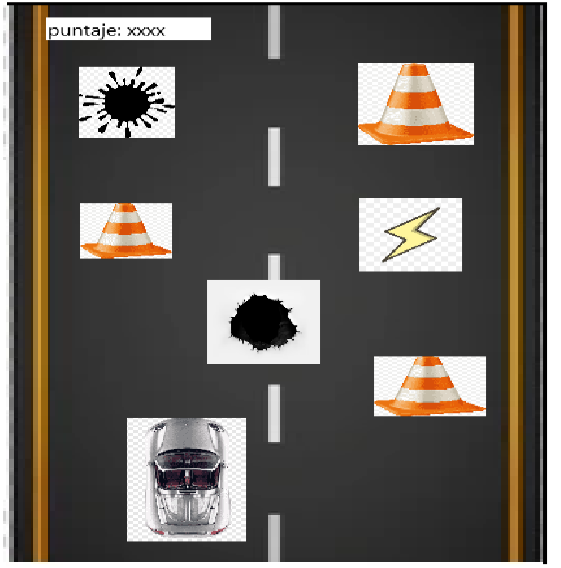

`                                                            `Idea de proyecto final

Por: juan José parra y tomas fernandez

 

Video de inspiracion: https://youtu.be/Xw\_dkT\_bDgA?si=-Dn7nyIS-vpwWNgr

Los usuarios de git hub son: tomasfern08 y JuanJoseParra1

Los correos correspondientes son: e8jparra2@colsanjose.edu.co y e8tfernand@colsanjose.edu.co

# Juego de Carreras: Esquiva Obstáculos y Suma Puntos

## Descripción

El juego es un juego de carreras donde el jugador controla un carro que debe esquivar una serie de obstáculos en el camino. A lo largo de la carrera, el carro puede recolectar *power-ups* que le ayudarán a sumar puntos y mejorar su rendimiento. El objetivo principal es avanzar lo más lejos posible mientras se evitan los obstáculos y se recolectan estos objetos especiales.

## Características

- **Carreras emocionantes**: Maneja tu carro a través de diferentes tipos de terrenos mientras esquivas obstáculos que aparecen aleatoriamente.
- **Obstáculos**: Los obstáculos incluyen objetos estáticos y móviles que representan un reto constante para el jugador.
- **Power-ups**: Recoge diferentes power-ups que pueden proporcionarte ventajas como velocidad extra, protección temporal contra obstáculos, o multiplicadores de puntos.
- **Puntaje**: Cada vez que recoges un power-up, o cada segundo que permaneces sin chocar, aumentas tu puntaje. El objetivo es lograr la mayor puntuación posible antes de que ocurra un accidente.

## Controles

- **Teclas de flecha (↑↓←→)**: Mover el carro hacia arriba, abajo, izquierda y derecha.
- **Espacio**: Activar el power-up (si está disponible).
  
## Cómo Jugar

1. **Inicia el juego**: Al comenzar, el carro comienza a moverse hacia adelante de manera automática.
2. **Esquiva obstáculos**: Usa las teclas de flecha para mover el carro y evitar obstáculos en el camino.
3. **Recolecta power-ups**: Los power-ups aparecerán aleatoriamente en el camino. Asegúrate de recogerlos para ganar puntos adicionales y obtener beneficios temporales.
4. **Aumenta tu puntaje**: Cuanto más tiempo sobrevivas y más power-ups recojas, mayor será tu puntaje.
5. **Supera tus récords**: El objetivo es obtener la mayor puntuación posible antes de que el carro colisione con un obstáculo.

## Requisitos

- **Plataforma**: El juego está diseñado para ser jugado en una plataforma web o aplicación móvil.
- **Requisitos técnicos**: Asegúrate de tener una conexión estable a internet y un navegador actualizado o la aplicación correspondiente para disfrutar del juego.

adjunto ejemplo: 
